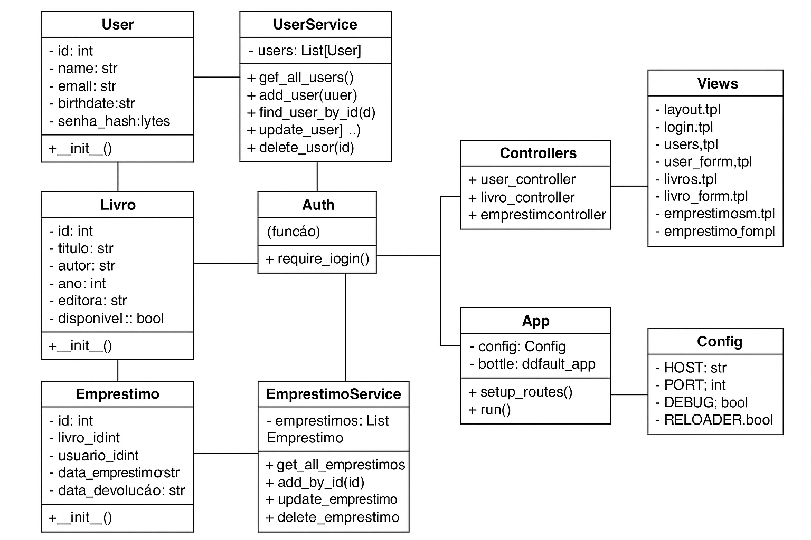

# Projeto Template: POO com Python + Bottle + JSON

Este é um projeto de template educacional voltado para o ensino de **Programação Orientada a Objetos (POO)** do Prof. Lucas Boaventura, Universidade de Brasília (UnB).

Utiliza o microframework **Bottle**. Ideal para uso em disciplinas introdutórias de Engenharia de Software ou Ciência da Computação.

## 💡 Objetivo

Fornecer uma base simples, extensível e didática para construção de aplicações web orientadas a objetos com aplicações WEB em Python, ideal para trabalhos finais ou exercícios práticos.

---
## 🎯 Funcionalidades do Sistema

### 👤 Usuários
- Cadastro de novos usuários (restrito a administradores)
- Login de usuários por e-mail e data de nascimento
- Cookies de sessão para manter usuários logados
- Dois tipos de usuários: **Administrador** (acesso total) e **Aluno** (acesso restrito)
- Logout com remoção de cookies

### 📖 Livros
- Listagem pública de livros
- Cadastro, edição e exclusão de livros (apenas por administradores)
- Validação de campos obrigatórios como título e autor

### 📚 Empréstimos *(em desenvolvimento)*
- Visualização de empréstimos do usuário autenticado
- Criação de novos empréstimos
- Regras de negócio previstas: limite de livros por aluno, controle de datas

### 🎨 Interface
- Layout responsivo com CSS customizado
- Menu horizontal estilizado
- Rodapé fixo com direitos autorais
- Uso de `layout.tpl` como template base

### 🛡️ Segurança e Controle de Acesso
- Proteção de rotas com `require_login()`
- Redirecionamento automático para o login quando necessário

### 💾 Persistência com JSON
- Dados persistidos em arquivos `.json`:
  - `users.json`
  - `livros.json`
  - *(futuramente)* `emprestimos.json`
- Operações CRUD feitas diretamente sobre esses arquivos 
---

## 🗂 Estrutura de Pastas

```bash
poo-python-bottle-template/
├── app.py # Ponto de entrada do sistema
├── config.py # Configurações e caminhos do projeto
├── main.py # Inicialização da aplicação
├── requirements.txt # Dependências do projeto
├── README.md # Este arquivo
├── controllers/ # Controladores e rotas
├── models/ # Definição das entidades (ex: User)
├── services/ # Lógica de persistência (JSON)
├── views/ # Arquivos HTML (Bottle Templating)
├── static/ # CSS, JS e imagens
├── data/ # Arquivos JSON de dados
└── .vscode/ # Configurações opcionais do VS Code
```
---
## Diagrama de classes



---

---

## 📁 Descrição das Pastas

### `controllers/`
Contém as classes responsáveis por lidar com as rotas da aplicação. Exemplos:
- `user_controller.py`: rotas para listagem, adição, edição e remoção de usuários.
- `base_controller.py`: classe base com utilitários comuns.

### `models/`
Define as classes que representam os dados da aplicação. Exemplo:
- `user.py`: classe `User`, com atributos como `id`, `name`, `email`, etc.

### `services/`
Responsável por salvar, carregar e manipular dados usando arquivos JSON. Exemplo:
- `user_service.py`: contém métodos como `get_all`, `add_user`, `delete_user`.

### `views/`
Contém os arquivos `.tpl` utilizados pelo Bottle como páginas HTML:
- `layout.tpl`: estrutura base com navegação e bloco `content`.
- `users.tpl`: lista os usuários.
- `user_form.tpl`: formulário para adicionar/editar usuário.

### `static/`
Arquivos estáticos como:
- `css/style.css`: estilos básicos.
- `js/main.js`: scripts JS opcionais.
- `img/BottleLogo.png`: exemplo de imagem.

### `data/`
Armazena os arquivos `.json` que simulam o banco de dados:
- `users.json`: onde os dados dos usuários são persistidos.

---

## ▶️ Como Executar

1. Crie o ambiente virtual na pasta fora do seu projeto:
```bash
python -m venv venv
source venv/bin/activate  # Linux/Mac
venv\\Scripts\\activate     # Windows
```

2. Entre dentro do seu projeto criado a partir do template e instale as dependências:
```bash
pip install -r requirements.txt
```

3. Rode a aplicação:
```bash
python main.py
```

4. Accese sua aplicação no navegador em: [http://localhost:8080](http://localhost:8080)

## 🧠 Autor e Licença
Projeto desenvolvido como template didático para disciplinas de Programação Orientada a Objetos, baseado no [BMVC](https://github.com/hgmachine/bmvc_start_from_this).
Você pode reutilizar, modificar e compartilhar livremente.
